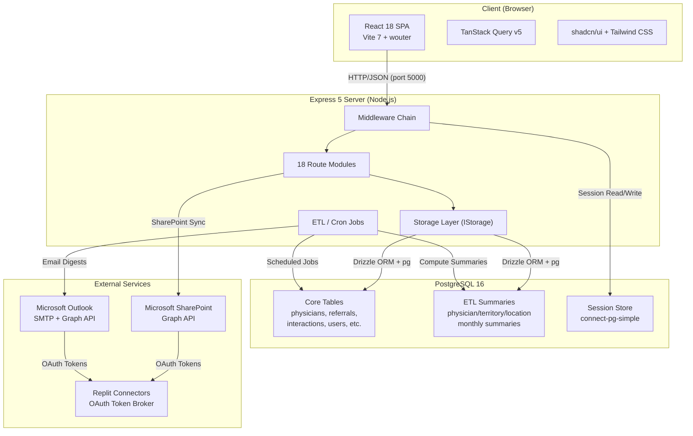
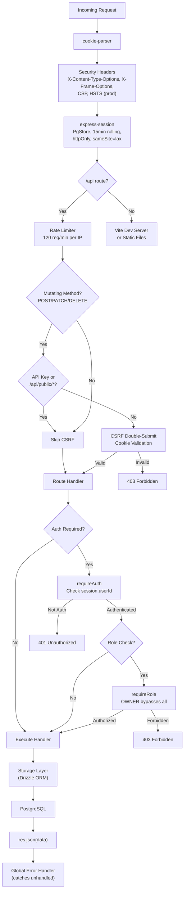
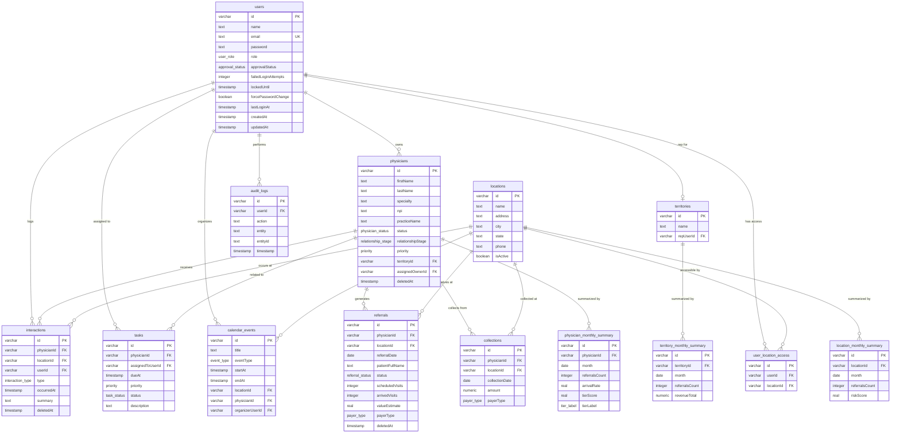
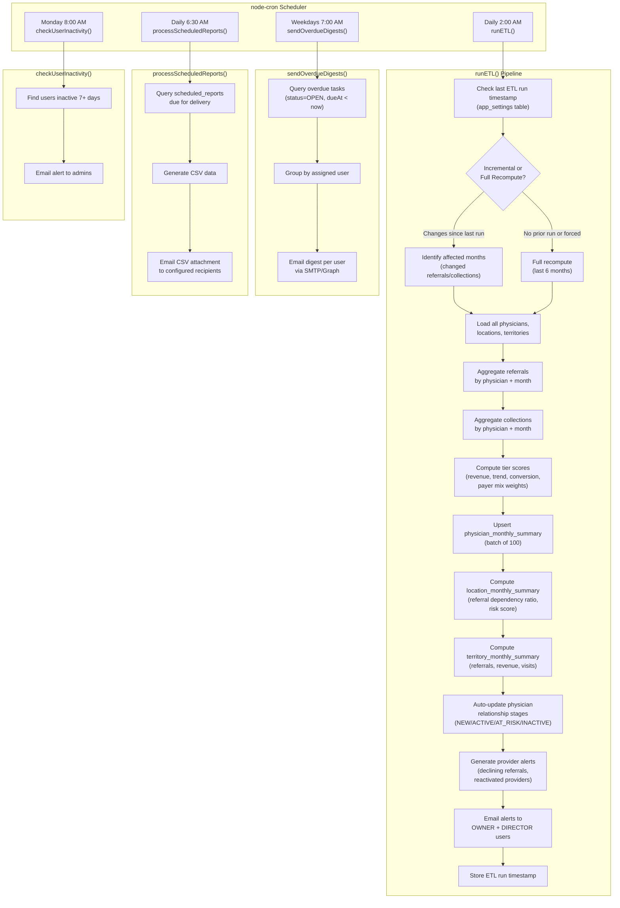
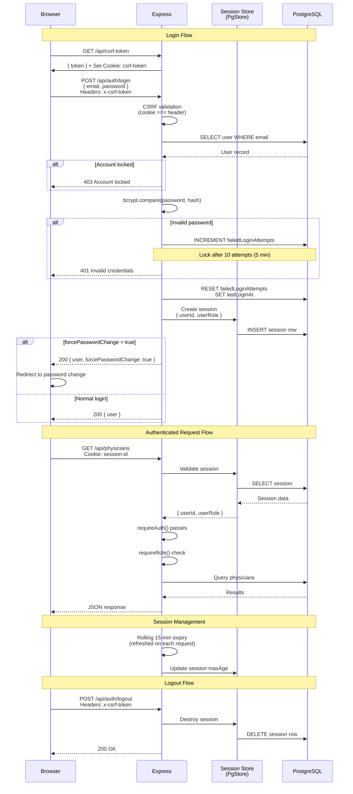

# Tristar 360° System Architecture Diagrams

## 1. High-Level System Architecture

## 2. Request Flow — Middleware Chain

## 3. Database Entity Relationship Diagram

## 4. ETL / Scheduled Jobs Flow

## 5. Authentication Flow

